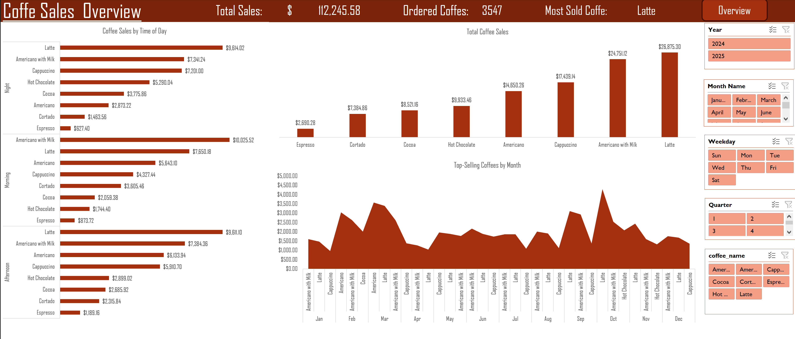
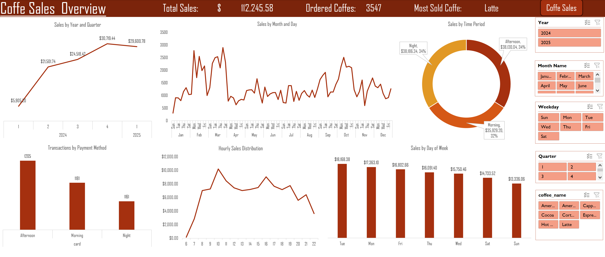

# ☕ Coffee Sales Analytics Dashboard

A dynamic, fully interactive two-page Microsoft Excel dashboard designed to analyze and visualize retail coffee sales data. This project demonstrates end-to-end data processing—from raw data ingestion and ETL (Extract, Transform, Load) using **Power Query** to multi-dimensional analysis with **Pivot Tables** and interactive visualization.

---

## 📸 Dashboard Gallery

> *Screenshots of the completed interactive dashboards. (To display your own images, save your screenshots in an `images` folder in your repository and update the paths below).*

### 1. Overview Dashboard
*High-level business health and executive key performance indicators.*



### 2. Coffee Sales Details Dashboard
*Granular product performance, temporal trends, and customer buying patterns.*



---

## 📊 Dashboard Key Features

### 1. Overview Dashboard
*   **Key Metrics (KPI Cards):** Total Revenue, Total Orders, Average Order Value, and Top-Selling Coffee Category.
*   **Trend Analysis:** Monthly sales performance over time with trend lines.
*   **Slicers:** Interactive timeline and category filters.

### 2. Coffee Sales Details Dashboard
*   **Breakdowns:** Sales by coffee type (Espresso, Latte, Cappuccino, Americano, etc.) and size.
*   **Temporal Insights:** Sales distribution by weekday and quarter.
*   **Granular Filters:** Multi-select slicers for Year, Quarter, Month, Weekday, and Coffee Type.

---

## 🛠️ Tech Stack & Tools Used

*   **Microsoft Excel:** Core platform for analysis, modeling, and visualization.
*   **Power Query (M):** Used for connecting to raw data, cleaning, handling missing values, changing data types, and adding custom/conditional columns.
*   **Pivot Tables & Pivot Charts:** Used to aggregate, summarize, and restructure data.
*   **Slicers & Timelines:** Linked across multiple sheets to provide a synchronized, interactive filtering experience.

---

## 🔄 Project Workflow (Data Pipeline)

### 1. Data Cleaning & Transformation (Power Query)
*   Imported raw sales transactional tables.
*   Removed duplicates, handled null values, and standardized date formats.
*   Created custom fields for advanced analysis (e.g., merging customer and order details, creating time-based groupings).
*   Loaded the clean, structured data back into Excel as a unified table.

### 2. Data Modeling & Aggregation (Pivot Tables)
*   Built structured Pivot Tables to isolate variables like sales by weekday, quarter, and product category.
*   Calculated running totals and year-over-year trends.

### 3. Dashboard Design & UI/UX
*   Applied a professional, cohesive color palette matching the "coffee theme" (warm, desaturated tones).
*   Created a consistent grid layout for charts and KPI cards to maximize readability.
*   Connected slicers to all pivot tables across both dashboards to ensure seamless, unified filtering.

---

## 🚀 How to Use the Dashboard

1.  Clone this repository or download the `.xlsx` file:
    ```bash
    git clone [https://github.com/your-username/coffee-sales-dashboard.git](https://github.com/your-username/coffee-sales-dashboard.git)
    ```
2.  Open the file in **Microsoft Excel** (Desktop version recommended for full slicer and Power Query compatibility).
3.  Use the **Timeline** slicer at the top of either sheet to filter the entire dataset by date range.
4.  Toggle the sidebar **Slicers** (e.g., Coffee Type, Size) to instantly update all visualizations and KPI cards.
5.  *(Optional)* To view the backend data cleaning process, go to the **Data** tab in Excel and click **Queries & Connections**.

---

## 📈 Key Insights Derived
*   **Weekday vs. Weekend Trends:** Identified peak purchasing days, helping optimize staffing and inventory.
*   **Product Performance:** Discovered which coffee types drive the highest revenue versus the highest order volume.
*   **Seasonal Fluctuations:** Visualized quarterly sales spikes to support targeted marketing campaigns.

---

## 📧 Contact & Connect
*   **Project Creator:** Business Information Systems Student | Data Analyst
*   **LinkedIn:** [Your LinkedIn Profile](https://linkedin.com/in/ed-mo1)
*   **Portfolio / GitHub:** [Your GitHub Profile](https://github.com/Ed-Mo1)
